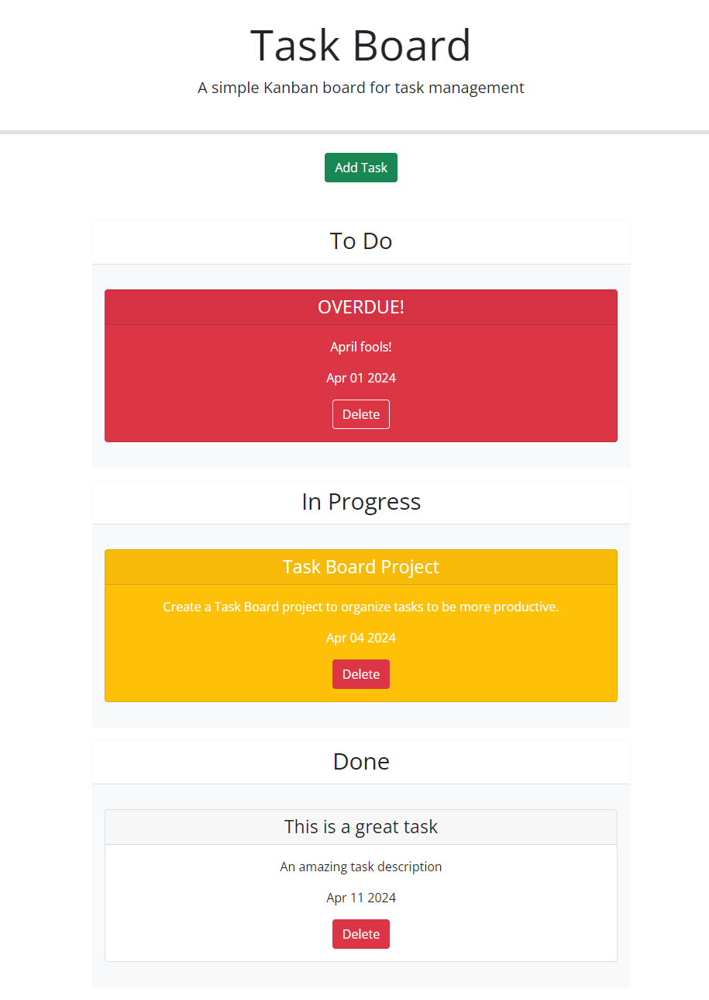

# Task-Board
https://mikedaleo.github.io/Task-Board/
## Description

A task board that allows a team to manage project tasks.

## Usage

Keep track of the progress and due dates of specific tasks by dynamically dragging them into different columns on the webpage. When a task is nearing the due date, the task card will change to yellow to alert you of the upcoming deadline. If you happen to miss a deadline, the task card with the past due deadline will turn red.

## Credits

Starter code provided by Rutgers Coding Bootcamp

## License

Please refer to the LICENSE in the repo.
